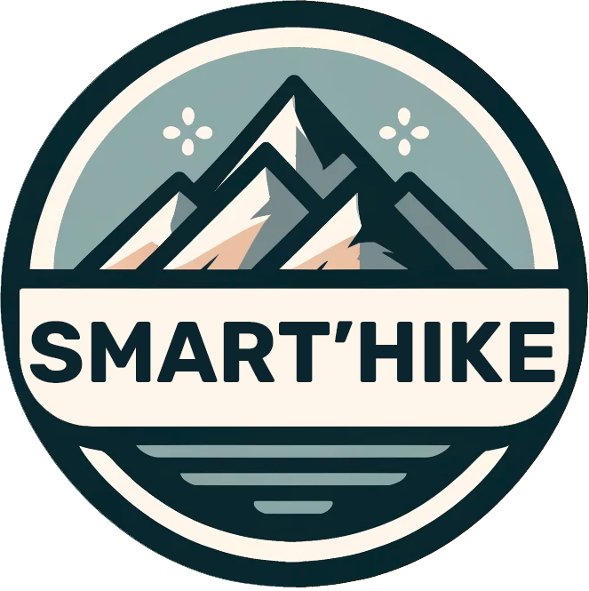

# Welcome to Smart'Hike :rocket:

End-of-year project for our first year in the MSC program at Epitech Nantes.  
We're a team of 5 students working on a project to offer our users personalized hiking routes to reach their final goal.

# What is Smart'Hike ?
Smart'Hike is a mobile application that allows you to create personalized hiking routes.

# Technologies

  

  


## Run projet
```bash
With make : 

make build
make install

With sh : 

Usage: ./smarthike {env(local|dev|ci|prod)} {build|down|re-build|logs|install|test}

./smarthike.sh local build
./smarthike.sh local install
```

## Authors
| Name              | Role                          | Github Profile |
|-------------------|-------------------------------|----------------|
| Eloi JAHAN        | Project Manager / Developer   | [@Eloi J](https://github.com/EloiJhn) |
| Julien MERCOURT   | Developer                     | [@Julien M](https://github.com/JuMercourt) |
| Charlotte LAURENT | Developer                     | [@Charlotte L](https://github.com/charlottelaurent50) |
| Valentin RAGOT    | Developer                     | [@Valentin R](https://github.com/ValentinRgt) |
| Alexendre TRESSEL | Developer                     | [@Alexandre T](https://github.com/PikPakPik) |


## API Documentation
[Swagger by Redoc](http://tyep600.valentinrgt.fr/)